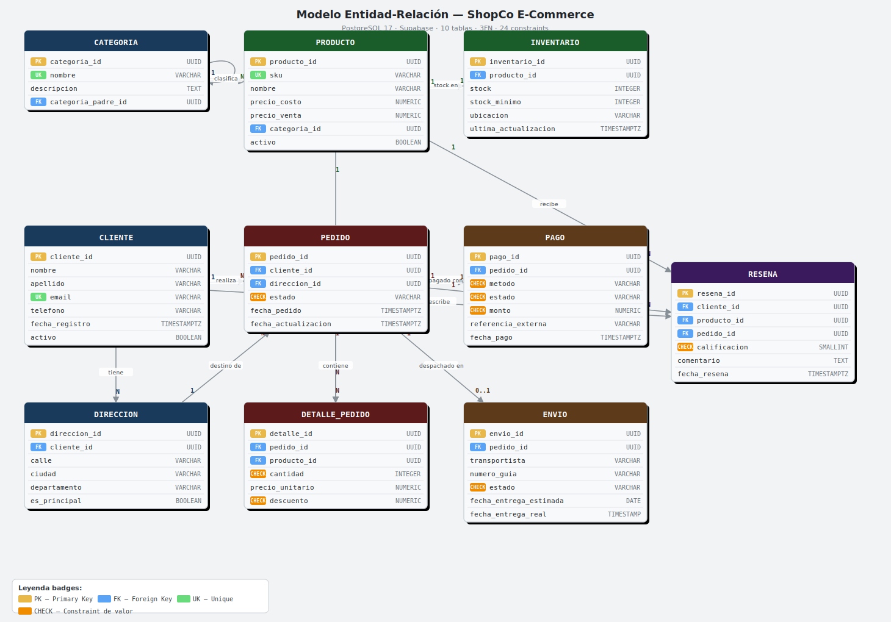

## {background-color="#0d1117" .cover}

::: {.cover-brand}
ShopCo
:::
::: {.cover-sub}
E-Commerce Colombia
:::
::: {.cover-divider}
:::
::: {.cover-title}
Optimización del Sistema de Bases de Datos
:::
::: {.cover-desc}
De 2 tablas sin constraints · a 10 tablas en producción · en la nube
:::
::: {.cover-metrics}
::: {.metric-box}
[$18.5M]{.mn-gold}
Revenue real
:::
::: {.metric-box}
[49.6%]{.mn-green}
ROI mes 1
:::
::: {.metric-box}
[$237M]{.mn-red}
Pérdida 3 años AS-IS
:::
:::

---

## El Problema {background-color="#110808"}

::: {.columns}
::: {.column width="53%"}

### ShopCo: 3 años con esta BD

```sql
-- BD ORIGINAL (2023–2026)
CREATE TABLE ventas (
  id      SERIAL PRIMARY KEY,
  email   VARCHAR(200),  -- sin UNIQUE: emails duplicados
  precio  NUMERIC,       -- sin CHECK: acepta negativos
  cantidad INTEGER,      -- sin CHECK: acepta 0 o negativo
  estado  VARCHAR(50)    -- sin ENUM: texto libre
);
CREATE TABLE productos (
  id    SERIAL PRIMARY KEY,
  precio NUMERIC,        -- sin restricción
  stock  INTEGER         -- podía llegar a -3
  -- 0 FK · 0 constraints · 0 vistas · 0 analytics
);
```
:::
::: {.column width="47%"}

### Errores encontrados en producción

::: {.err-box}
❌ Samsung A54 — **stock = −3** → 3 pedidos sin producto en bodega
:::
::: {.err-box}
❌ Venta registrada con **precio = −$449.000** sin detección
:::
::: {.err-box}
❌ "enviado" / "Enviado" / "en camino" → mismo estado, imposible filtrar
:::
::: {.err-box}
❌ Sin tabla de pagos → pedidos cobrados y sin cobrar mezclados
:::

::: {.loss-panel}
**PÉRDIDA MENSUAL CUANTIFICADA**

::: {.loss-grid}
::: {.loss-item-box}
[$3.6M]{.loss-val} Stock negativo
:::
::: {.loss-item-box}
[$1.4M]{.loss-val} Pagos sin confirmar
:::
::: {.loss-item-box}
[$1.6M]{.loss-val} Reconciliación manual
:::
:::
[→ **$79M pérdida anual** en 3 años sin optimizar]{.loss-total}
:::

:::
:::

---

## Nuestra Propuesta {background-color="#0d1117"}

::: {.prop-grid}
::: {.prop-card .card-blue}
🗄️

**SQL Robusto**

10 tablas · 3FN
24 constraints verificables
3 vistas analíticas
1 stored procedure · 3 funciones
8 índices de soporte

[✓ En producción — Supabase]{.badge-gold}
:::

::: {.prop-card .card-green}
🍃

**NoSQL Complementario**

MongoDB Atlas M10
3 colecciones diseñadas
5 aggregation pipelines
TTL automático (90/30 días)
Integración por UUID con SQL

[✓ Diseñado e integrado]{.badge-gold}
:::

::: {.prop-card .card-orange}
☁️

**Arquitectura Cloud AWS**

Lambda + API Gateway
Supabase + MongoDB Atlas
S3 · CloudFront · IAM
Secrets Manager · CloudWatch
us-east-1 — misma región

[$684K COP/mes con IVA]{.badge-gold}
:::
:::

---

## ER y Reglas de Negocio {background-color="#0d1117"}

::: {.columns}
::: {.column width="50%"}

{width="100%" style="border-radius:8px; border:1px solid #1a3a5c;"}

:::
::: {.column width="50%"}

::: {.er-table}
| Tipo | N° | Ejemplo clave |
|------|:--:|---------------|
| CHECK | 10 | `precio_venta ≥ precio_costo` |
| UNIQUE | 7 | `email` · `sku` · 1 pago/pedido |
| FK | 5 | Integridad referencial total |
| ENUM | 4 | Estados pedido / pago / envío |
:::

::: {.constraint-highlight}
**Constraint estrella**
```sql
CONSTRAINT ck_precio_venta_mayor_costo
  CHECK (precio_venta >= precio_costo)
```
✓ Elimina ventas a pérdida desde la BD
:::

::: {.sp-highlight}
**SP ejecutado en producción — 21 mayo 2026**

`sp_procesar_pedido()` →
→ Creó pedido #11 · Valentina Ríos
→ Decrementó Samsung A54: 48 → 44 uds
→ Registró pago Nequi $1.199.000
→ **Transacción atómica** (todo o nada)
:::

:::
:::

---

## SQL en Producción {background-color="#0d1117"}

::: {.columns}
::: {.column width="48%"}

### 8 scripts — todos verificados en Supabase ✓

::: {.sql-table}
| Script | Qué hace | Verificado |
|--------|----------|:----------:|
| `01_ddl.sql` | 10 tablas + 24 constraints + 8 índices | ✓ |
| `02_dml.sql` | INSERT masivo · UPDATE estado · DELETE limpieza | ✓ |
| `03_joins.sql` | 4 JOINs multi-tabla + 3 subconsultas correlacionadas | ✓ |
| `04_agr.sql` | GROUP BY · HAVING · revenue por categoría | ✓ |
| `05_window.sql` | RANK · ROW_NUMBER · LAG · PERCENT_RANK | ✓ |
| `06_vistas.sql` | vista_pedidos / inventario_critico / performance | ✓ |
| `07_sp.sql` | `sp_procesar_pedido` — ejecutado en producción | ✓ |
| `08_func.sql` | `fn_total_pedido` · `fn_margen` · `fn_segmento` | ✓ |
:::

:::
::: {.column width="52%"}

### Segmentación real ejecutada en Supabase

```sql
SELECT c.nombre, fn_cliente_segmento(c.cliente_id)
FROM cliente c WHERE activo = TRUE;
```

::: {.seg-table}
| Cliente | Gasto total | Segmento |
|---------|-------------|:--------:|
| Valentina Ríos | $7.557.000 | 🥇 **Platinum** |
| Sebastián Morales | $3.799.000 | 🥈 Gold |
| Daniela Castro | $2.494.700 | 🥈 Gold |
| Nicolás Pérez | $2.278.100 | 🥈 Gold |
| Laura Vargas | $1.899.000 | 🥉 Silver |
| Andrés Gutiérrez | $449.000 | Bronze |
:::

::: {.sql-note}
💡 `fn_cliente_segmento()` clasifica automáticamente basado en gasto histórico acumulado de pagos aprobados. Se usa para campañas de fidelización y descuentos personalizados.
:::

:::
:::

---

## NoSQL — MongoDB Atlas {background-color="#0d1117"}

::: {.columns}
::: {.column width="46%"}

### 3 colecciones diseñadas

::: {.mongo-card .mc-blue}
**📦 catalogo_productos**
`_id` = `producto_id` de PostgreSQL
Imágenes · tags · specs técnicas variables
Historial de precios · calificación promedio
→ *Esquema flexible: cada categoría tiene atributos distintos*
:::

::: {.mongo-card .mc-green}
**📊 sesiones_usuario** · TTL 90 días
Eventos: vistas, búsquedas, clics, checkout
Soporta usuarios anónimos (`anon_fingerprint`)
→ *Alto volumen de escritura — no apto para SQL*
:::

::: {.mongo-card .mc-orange}
**🛒 carritos_abandonados** · TTL 30 días
Items + precios al momento del abandono
Stock validado en vivo desde PostgreSQL
→ *Remarketing automático por email*
:::

:::
::: {.column width="54%"}

### 5 Aggregation Pipelines

::: {.agg-box}
```javascript
// AGG-1: Top productos más vistos por categoría
db.sesiones_usuario.aggregate([
  { $unwind: "$eventos" },
  { $match: { "eventos.tipo": "vista_producto" } },
  { $group: { _id: "$eventos.producto_id",
               total_vistas: { $sum: 1 },
               tiempo_promedio: { $avg: "$eventos.tiempo_en_pagina_seg" }
             }},
  { $sort: { total_vistas: -1 } }
])
// AGG-2: Revenue en carritos abandonados
// AGG-3: Funnel vista→carrito→checkout
// AGG-4: Segmentación por sesiones ($bucket)
// AGG-5: Carritos activos + stock en vivo (PostgreSQL)
```
:::

::: {.integration-box}
🔗 **Integración relacional**
`producto_id` y `cliente_id` en MongoDB son los mismos UUID de PostgreSQL — no se duplica data, solo se enriquece
:::

:::
:::

---

## Análisis de Resultados {background-color="#0d1117"}

### 6 queries con datos reales de Supabase

::: {.results-grid}
::: {.res-card}
**📊 Revenue por categoría**

::: {.bar-block}
Electrónica · [$16.4M]{.rv-gold}
::: {.bar-fill style="width:80%;background:#e8b84b"}
:::
Ropa y Moda · [$2.2M]{.rv-blue}
::: {.bar-fill style="width:13%;background:#5ba4f5"}
:::
Deportes · [$1.9M]{.rv-green}
::: {.bar-fill style="width:10%;background:#2d9a4e"}
:::
:::

[💡 Electrónica = **80%** del revenue con solo 7 uds vendidas. Priorizar stock y campañas aquí.]{.insight-text}
:::

::: {.res-card}
**👑 Clientes por valor**

::: {.client-list}
Valentina Ríos · [$7.6M]{.rv-gold} · Platinum
Sebastián Morales · [$3.8M]{.rv-blue} · Gold
Daniela Castro · [$2.5M]{.rv-blue} · Gold
Nicolás Pérez · [$2.3M]{.rv-blue} · Gold
Laura Vargas · [$1.9M]{.rv-green} · Silver
Andrés Gutiérrez · [$449K]{.rv-gray} · Bronze
:::

[💡 1 cliente = **41%** del revenue. 83% compraron 1 sola vez → campaña de retención urgente.]{.insight-text}
:::

::: {.res-card}
**🏆 Métricas operativas**

::: {.kpi-list}
PSE aprobación · [100%]{.rv-green}
NPS implícito · [4.8/5 ⭐]{.rv-green}
Servientrega · [100% · 2 días]{.rv-green}
Mayor margen · [Bici 36.8%]{.rv-gold}
Stock crítico · [4 uds ⚠️]{.rv-red}
Sin reseñas · [Lenovo · 30 uds]{.rv-gold}
:::

[💡 PSE es el método más confiable. Daviplata tiene 0% aprobación — revisar integración.]{.insight-text}
:::
:::

---

## ROI e Impacto Financiero {background-color="#0d1117"}

::: {.columns}
::: {.column width="52%"}

### La inversión se paga en el mes 1

::: {.roi-top}
::: {.roi-box-l}
Inversión inicial
[$97.2M COP]{.roi-gold}
Desarrollo + setup AWS
:::
::: {.roi-box-r}
Beneficio neto/mes
[$145.5M COP]{.roi-green}
Escenario base (500 pedidos)
:::
:::

| Escenario | Revenue/mes | Costo op. | ROI |
|-----------|-------------|-----------|-----|
| **Base** 500 ped. | $175M | $29.5M | [**+49.6%**]{.rv-green} |
| **Optimista** 750 | $262.5M | $30.7M | [**+138.6%**]{.rv-green} |
| **Pesimista** 200 | $70M | $29.5M | [+24.8%]{.rv-gold} |

:::
::: {.column width="48%"}

### Ahorro generado por la optimización

::: {.saving-row .sr-green}
Pérdidas eliminadas → **+$6.6M/mes**
Stock · pagos sin confirmar · Excel manual
:::
::: {.saving-row .sr-green}
**Ahorro anual total → $79.2M COP/año**
:::
::: {.saving-row .sr-gold}
Infra cloud → **$684K/mes** con IVA 19%
vs $84K del VPS sin backups ni escalabilidad
:::

::: {.breakeven-box}
**Punto de equilibrio: Mes 1**
La inversión inicial de $97.2M queda cubierta
por el beneficio neto del primer mes de operación
:::

:::
:::

---

## Arquitectura Cloud — AWS {background-color="#0d1117"}

::: {.columns}
::: {.column width="50%"}

::: {.arch-diagram}
```
  ┌─────────────────────────────────┐
  │     USUARIOS / INTERNET         │
  └──────────────┬──────────────────┘
                 │ HTTPS / TLS 1.3
  ┌──────────────▼──────────────────┐
  │   CloudFront CDN  (us-east-1)   │
  │   Cache imágenes · assets       │
  └──────────────┬──────────────────┘
                 │
  ┌──────────────▼──────────────────┐
  │  API Gateway  →  Lambda         │
  │  Rate limit · JWT auth          │
  └──────┬───────────────┬──────────┘
         │               │
  ┌──────▼──────┐  ┌─────▼────────┐
  │  Supabase   │  │ MongoDB Atlas │
  │ PostgreSQL  │  │  M10 NoSQL   │
  │ (SQL + RLS) │  │ Catálogo/Ev. │
  └──────┬──────┘  └─────┬────────┘
         └───────┬────────┘
  ┌──────────────▼──────────────────┐
  │  S3: imágenes · backups · logs  │
  └─────────────────────────────────┘
  Secrets Manager · IAM · CloudWatch
```
:::

:::
::: {.column width="50%"}

### Servicios y justificación

::: {.service-list}
::: {.svc-row}
**Lambda + API Gateway** → Compute serverless
Sin gestión de servidores · escala a 0 en idle
$0 cuando no hay tráfico
:::
::: {.svc-row}
**Supabase Pro** → PostgreSQL gestionado
Backups automáticos · Row Level Security
Ya operativo en us-east-1
:::
::: {.svc-row}
**MongoDB Atlas M10** → BD documental
2 vCPU · 2 GB RAM · misma región
TTL nativo · Atlas Search full-text
:::
::: {.svc-row}
**S3 + CloudFront** → Storage + CDN
11-noves de durabilidad · distribución global
Lifecycle policies automáticas
:::
::: {.svc-row}
**Secrets Manager + IAM** → Seguridad
Credenciales rotadas automáticamente
Principio de mínimo privilegio por función
:::
:::

[**Región:** us-east-1 — misma región que Supabase → 0 latencia entre servicios]{.region-note}

:::
:::

---

## Legal, Ético y Roadmap {background-color="#0d1117"}

::: {.columns}
::: {.column width="48%"}

### Marco normativo aplicado

::: {.law-table}
| Norma | Alcance |
|-------|---------|
| **Ley 1581/2012** 🇨🇴 | Datos personales en Colombia |
| **Decreto 1377/2013** | Autorización y política de privacidad |
| **Ley 527/1999** | Validez contratos electrónicos |
| **PCI DSS v4.0** | Pagos — SAQ A, sin almacenar tarjetas |
| **GDPR** 🇪🇺 | Expansión futura a Unión Europea |
| **ISO 27001** | Seguridad de la información |
| **OWASP Top 10** | Queries parametrizadas, sin SQLi |
:::

::: {.legal-note}
ShopCo **nunca almacena** números de tarjeta.
El procesamiento ocurre íntegramente en la pasarela certificada.
:::

:::
::: {.column width="52%"}

### Roadmap de implementación

::: {.road-item .road-done}
✅ **Fase 0 — Completado**
BD SQL optimizada en Supabase · Módulo NoSQL diseñado
Análisis de resultados con datos reales · Cloud architecture
:::

::: {.road-item .road-next}
**→ Fase 1 — 30 días**
Deploy AWS Lambda + API Gateway
Integración pasarelas PSE · Nequi · Daviplata
:::

::: {.road-item .road-next}
**→ Fase 2 — 60 días**
Dashboard analítico en tiempo real
Programa de fidelización Platinum/Gold
:::

::: {.road-item .road-next}
**→ Fase 3 — 6 meses**
Motor de recomendaciones basado en historial
Expansión catálogo + nuevas categorías
:::

:::
:::

---

## {background-color="#0d1117" .closing-slide}

::: {.closing-content}
::: {.cl-title}
De $237M en pérdidas
:::
::: {.cl-title2}
a ROI positivo en el mes 1
:::
::: {.cl-hr}
:::
::: {.cl-metrics}
::: {.cl-box}
[10]{.cl-num}
Tablas en 3FN
:::
::: {.cl-box}
[24]{.cl-num}
Reglas de negocio
:::
::: {.cl-box}
[3]{.cl-num}
Colecciones NoSQL
:::
::: {.cl-box}
[49.6%]{.cl-num-green}
ROI mes 1
:::
:::
::: {.cl-cta}
ShopCo tiene los datos, la arquitectura y el análisis para escalar.
**Solo falta ejecutar.**
:::
::: {.cl-link}
github.com/julianjimenez4809-ui/proyecto-final-bases-datos
:::
:::
