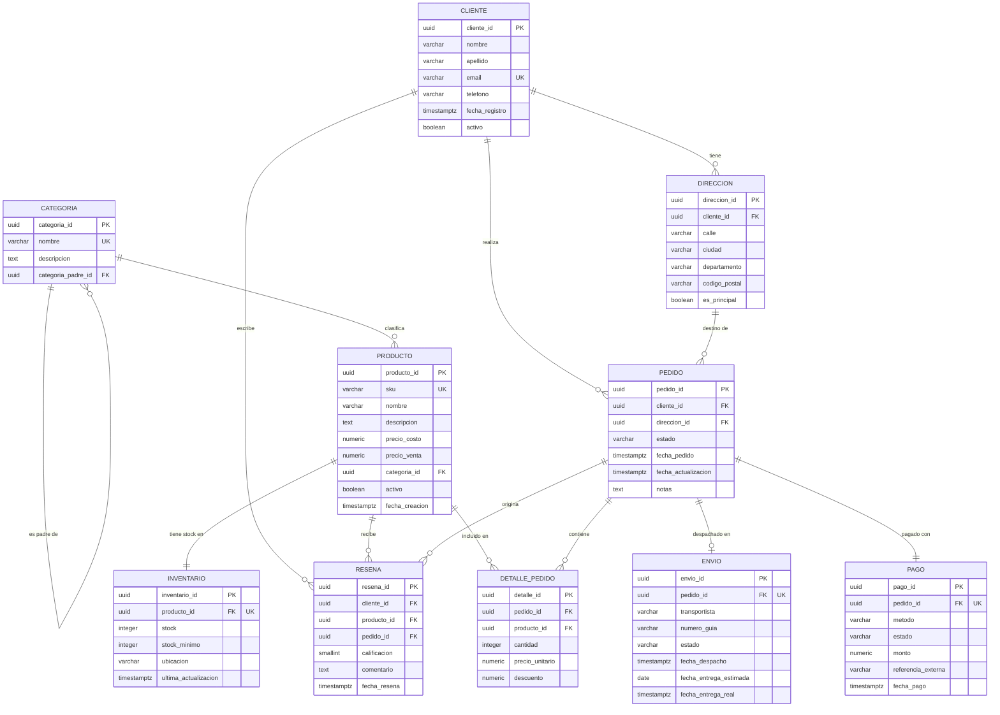

# Modelo Entidad-Relación — ShopCo E-Commerce

## Diagrama ER

---

## Descripción de entidades

### CATEGORIA
Organiza los productos en una jerarquía de dos niveles. `categoria_padre_id` es auto-referenciada y nullable — las categorías raíz (Electrónica, Ropa, Hogar) no tienen padre; las subcategorías (Smartphones, Computadores) sí. El constraint `uq_categoria_nombre` garantiza nombres únicos.

### CLIENTE
Representa al comprador registrado. El `email` es la clave natural única de identificación. `activo = FALSE` implementa soft delete — el cliente deja de poder comprar pero sus pedidos históricos se conservan.

### DIRECCION
Un cliente puede tener múltiples direcciones. `es_principal = TRUE` marca la dirección predeterminada. Una dirección no puede ser eliminada si tiene pedidos asociados (FK protegida).

### PRODUCTO
Catálogo de artículos vendibles. El constraint `ck_precio_venta_mayor_costo` garantiza que `precio_venta >= precio_costo`, asegurando margen positivo. `activo = FALSE` retira el producto del catálogo sin eliminarlo.

### INVENTARIO
Relación 1-a-1 con PRODUCTO (`uq_inventario_producto`). Registra el stock disponible y el umbral mínimo de alerta. `ck_stock_no_negativo` impide valores negativos. El stored procedure `sp_procesar_pedido` actualiza este registro de forma atómica.

### PEDIDO
Orden de compra de un cliente hacia una dirección. Los estados siguen el ciclo: `pendiente → procesando → enviado → entregado` (o `cancelado`). Relaciona CLIENTE, DIRECCION, DETALLE_PEDIDO, PAGO y ENVIO.

### DETALLE_PEDIDO
Tabla intermedia N:M entre PEDIDO y PRODUCTO. Almacena el `precio_unitario` en el momento de la compra (precio histórico, independiente de cambios futuros en PRODUCTO) y el `descuento` aplicado.

### PAGO
Relación 1-a-1 con PEDIDO (`uq_pago_pedido`). Registra el método, estado y monto real cobrado. `referencia_externa` almacena el ID de transacción de la pasarela (PSE, Nequi, etc.).

### ENVIO
Relación 1-a-1 con PEDIDO (`uq_envio_pedido`). Solo existe si el pedido fue despachado. Registra transportista, guía y fechas de despacho/entrega para calcular SLA logístico.

### RESENA
Un cliente puede reseñar un producto específico de un pedido específico. El constraint `uq_resena_cliente_producto_pedido` garantiza máximo una reseña por combinación, evitando inflación de calificaciones.

---

## Cardinalidades

| Relación | Tipo | Descripción |
|---|---|---|
| CATEGORIA → CATEGORIA | 0..N (recursiva) | Una categoría puede tener subcategorías |
| CATEGORIA → PRODUCTO | 1..N | Una categoría clasifica muchos productos |
| CLIENTE → DIRECCION | 1..N | Un cliente tiene una o más direcciones |
| CLIENTE → PEDIDO | 1..N | Un cliente realiza uno o más pedidos |
| CLIENTE → RESENA | 0..N | Un cliente puede escribir múltiples reseñas |
| DIRECCION → PEDIDO | 1..N | Una dirección puede ser destino de varios pedidos |
| PEDIDO → DETALLE_PEDIDO | 1..N | Un pedido contiene uno o más ítems |
| PRODUCTO → DETALLE_PEDIDO | 0..N | Un producto puede aparecer en muchos pedidos |
| PRODUCTO → INVENTARIO | 1..1 | Cada producto tiene exactamente un registro de stock |
| PEDIDO → PAGO | 1..1 | Cada pedido tiene exactamente un pago |
| PEDIDO → ENVIO | 0..1 | Un pedido puede o no tener envío (e.g., cancelado) |
| PEDIDO → RESENA | 0..N | Un pedido puede generar múltiples reseñas (una por producto) |

---

## Normalización

El modelo cumple **3FN (Tercera Forma Normal)**:

- **1FN:** Todos los atributos son atómicos, no hay grupos repetitivos.
- **2FN:** En `detalle_pedido`, `precio_unitario` depende del par `(pedido_id, producto_id)`, no solo de uno de ellos.
- **3FN:** No existen dependencias transitivas. El `precio_unitario` en `detalle_pedido` no depende de `producto.precio_venta` — es el precio capturado en el momento de compra.

El supertipo/subtipo más relevante es **CATEGORIA** con jerarquía recursiva, justificado porque la profundidad del árbol es controlada (máximo 2 niveles en ShopCo).
